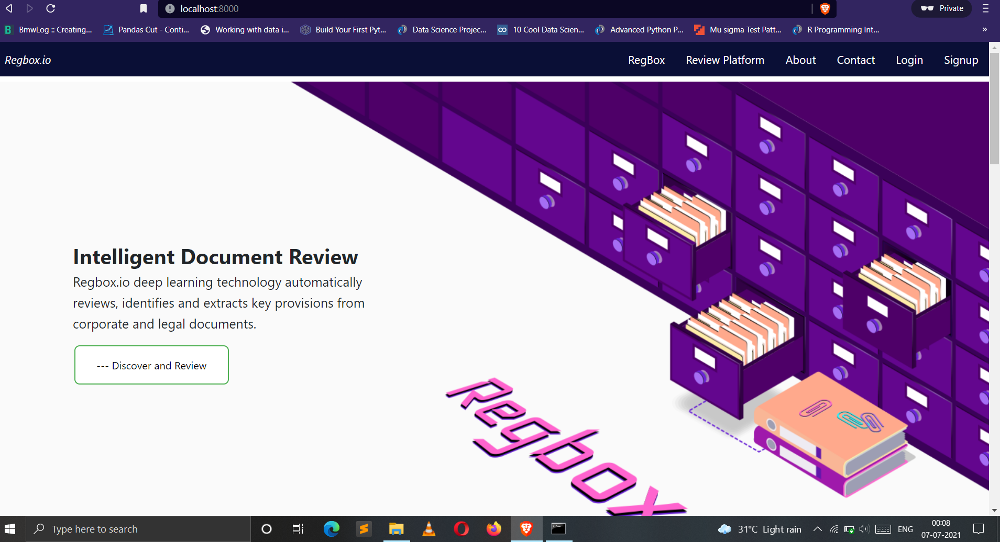

# Regbox
Smart KYC documents management web application

Problem Statement : To create a portal/platform where users can be verified and authenticated and their data can be stored and managed as well. User need to be verified using the documents provided by the government of India.

Some Screenshots of app:

  

  
  
  
  
 
	
  

	

   
	

Installation Process:

Create virtual environment : >>virtual venv 

Activate : >>venv\Scripts\activate 

Deactivate: >>deactivate

A requirement file is there which contains all the python packages with their versions specified that need to be installed.

We also need to create an empty folder named ‘media’ inside our kyc directory in the project. 

Apply migrate function to apply the models migrations and create the database file as well.

After this the user can run the command : 
	python manage.py runserver

we can access our project from any web browser at : http://127.0.0.1:8000/ or localhost:8000 
